# 🐂 Bulls & Bears — Word Puzzle Arena 🐻

A professional-grade, production-ready **5-letter word puzzle platform** built with **Python (Flask)** and **Vanilla JS/CSS**. Guess the secret word, beat the clock, and climb the leaderboard!


---

## 🎮 Game Overview

**Bulls & Bears** is a Wordle-inspired word guessing game with a competitive twist:

- **Guess** a secret **5-letter word** in **6 attempts** or less
- **Race** a **4-minute countdown timer** — the faster you solve, the higher your score
- **Compete** on the global leaderboard against other players

### Feedback System

| Symbol | Name | Meaning |
|--------|------|---------|
| 🟩 Green | **Bull** | Correct letter in the correct position |
| 🟨 Yellow | **Bear** | Correct letter in the wrong position |
| ⬛ Gray | **Miss** | Letter not in the word |

### Scoring

- **+1 point** for solving the word
- **+0.1 points** for every second remaining on the 4-minute clock
- **Maximum possible score**: ~25 points (solving in under 2 seconds)

---

## ✨ Features

- 🔐 **User Authentication** — Register & Login with hashed passwords
- 🎯 **5-Letter Word Puzzle** — 160+ curated English words
- ⏱️ **4-Minute Timer** — Visual urgency when time runs low
- ⌨️ **Keyboard Tracker** — Color-coded letter elimination
- 🏆 **Leaderboard** — Top 20 players with podium display
- 👤 **Profile System** — Edit display name, email, view personal stats
- 🌙 **Dark Glassmorphism UI** — Premium design with animations
- 📱 **Fully Responsive** — Works on desktop, tablet, and mobile
- 🚀 **Zero Setup DB** — Auto-creates database, tables, and seeds words on first run

---

## 📁 Project Structure

```
bulls_and_bears/
├── main.py              # Flask backend — API server & entry point
├── index.html           # Single-page application (4 views + modals)
├── style.css            # Dark glassmorphism design system
├── game.js              # SPA controller & game engine
├── schema.sql           # MySQL schema reference
└── requirements.txt     # Python dependencies
```

**6 files total** — clean, consolidated, production-ready.

---

## 🚀 Quick Start

### Prerequisites

- **Python 3.9+** installed
- **MySQL 8.x** running locally


### Installation

```bash
# 1. Clone the repository
git clone https://github.com/YOUR_USERNAME/bulls-and-bears.git
cd bulls-and-bears

# 2. Install Python dependencies
pip install -r requirements.txt

# 3. Start the application
python main.py
```

That's it! The application will:
- ✅ Create the `Bulls_Bears_Game_Scores` database automatically
- ✅ Create all required tables (`users`, `words`, `scores`, `attempts`)
- ✅ Seed 160+ five-letter words
- ✅ Start the Flask server on **http://127.0.0.1:5000**

### Environment Variables (Optional)

| Variable | Default | Description |
|----------|---------|-------------|
| `DB_HOST` | `localhost` | MySQL host |
| `DB_USER` | Username | MySQL username |
| `DB_PASSWORD` |password | MySQL password |
| `DB_NAME` | `Bulls_Bears_Game_Scores` | Database name |
| `DB_PORT` | `3306` | MySQL port |
| `SECRET_KEY` | (auto-generated) | Flask session secret |

---

## 🏗️ Architecture

### Application Workflow

```mermaid
flowchart TD
    A["🔐 Auth Page\nLogin / Register"] -->|Login Success| B["📋 Mission Briefing\nGame Rules & Scoring"]
    B -->|Click 'Let's Play'| C["🎮 Game Arena\n5-Letter Word Puzzle"]
    
    C -->|Type 5-letter word| D{"Submit Guess"}
    D -->|Green / Yellow / Gray\nfeedback| E{"Game Over?"}
    
    E -->|"No (attempts < 6\nand time > 0)"| C
    E -->|"Win ✅"| F["🎉 Victory Modal\nScore + Correct Word"]
    E -->|"Loss ❌ (6 attempts\nor timer expired)"| G["💪 Defeat Modal\nCorrect Word Revealed"]
    
    F -->|Play Again| C
    F -->|View Leaderboard| H["🏆 Leaderboard\nTop 20 Ranked Players"]
    G -->|Play Again| C
    G -->|View Leaderboard| H
    
    H -->|Play Again| C
    H -->|Back to Home| B
    
    B -->|Click Profile| I["👤 Profile Modal\nEdit Name, Email + Stats"]
    I -->|Save & Close| B

    style A fill:#6c5ce7,stroke:#a29bfe,color:#fff
    style B fill:#0f1526,stroke:#6c5ce7,color:#e8ecf1
    style C fill:#0f1526,stroke:#00cec9,color:#e8ecf1
    style F fill:#00b894,stroke:#00b894,color:#fff
    style G fill:#ff6b6b,stroke:#ff6b6b,color:#fff
    style H fill:#ffd700,stroke:#f0932b,color:#0a0e1a
    style I fill:#0f1526,stroke:#fd79a8,color:#e8ecf1
```



**Flow Summary:**
```
Auth Page ──→ Game Rules ──→ Game Arena ──→ Result Modal ──→ Leaderboard
  (Login/       (Mission      (5-letter       (Win/Loss       (Top 20
  Register)     Briefing)      Puzzle)        + Score)        Ranking)
```

### Tech Stack

| Layer | Technology |
|-------|-----------|
| **Backend** | Python 3 + Flask |
| **Frontend** | Vanilla JavaScript (ES6+) |
| **Styling** | Vanilla CSS with CSS Variables |
| **Database** | MySQL 8.x |
| **Auth** | Werkzeug password hashing + Flask sessions |
| **Fonts** | Google Fonts (Inter) |

### API Endpoints

| Method | Endpoint | Description |
|--------|----------|-------------|
| `POST` | `/api/register` | Create a new account |
| `POST` | `/api/login` | Sign in |
| `POST` | `/api/logout` | Sign out |
| `GET` | `/api/me` | Get current user info |
| `PUT` | `/api/profile` | Update display name & email |
| `GET` | `/api/stats` | Get personal game statistics |
| `POST` | `/api/start_game` | Start a new round |
| `POST` | `/api/guess` | Submit a 5-letter guess |
| `GET` | `/api/leaderboard` | Get top 20 scores |

### Database Schema

```sql
users       → id, username, password_hash, display_name, email, role, created_at
words       → id, word (5-letter, unique)
scores      → id, user_id, score, attempts, result, time_taken, played_at
attempts    → id, user_id, game_id, guess, feedback, attempt_number, created_at
```

---

## 🎨 Design

The UI features a **dark glassmorphism** aesthetic:

- **Background**: Deep navy (#0a0e1a) with floating animated orbs
- **Cards**: Frosted glass effect with `backdrop-filter: blur(20px)`
- **Accents**: Purple (#6c5ce7), Cyan (#00cec9), Pink (#fd79a8) gradients
- **Typography**: Inter font family (300–900 weights)
- **Animations**: Tile flip reveals, keyboard pop, timer pulse, hover micro-interactions

---

## 🧑‍💻 Development

### Game Logic (Bulls & Bears Algorithm)

```
1. Green Pass: Mark exact position matches first
2. Yellow Pass: Mark remaining letters that exist in wrong positions
3. Gray: Everything else is marked as absent
```

This two-pass approach prevents duplicate letter coloring issues.

### Admin Access

Register with a username containing `admin` (e.g., `admin1`) to get admin privileges for future admin features.

---

## 👥 Team

**Team 1** — SEF Hackathon 2026

---

## 📄 License

This project is licensed under the MIT License. See [LICENSE](LICENSE) for details.


